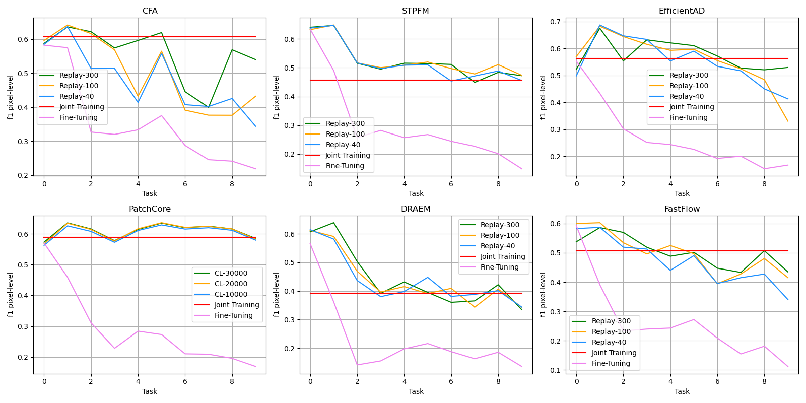
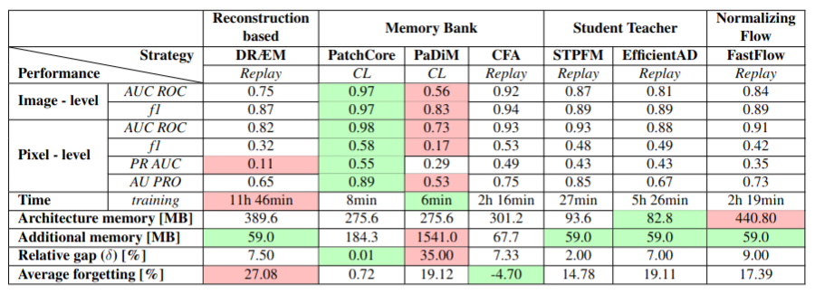

# Unveiling the Anomalies in an Ever-ChangingWorld: <br> A Benchmark for Pixel-Level Anomaly Detection in Continual Learning

<!--  CLAD: Continual Learning (Visual) Anomaly Detection Benchmark -->


## Abstract

<em>
Anomaly Detection is a relevant problem in numerous real-world applications, especially when dealing with images. However, little attention has been paid to the issue of changes over time in the input data distribution, which may cause a significant decrease in performance. In this study, we investigate the problem of Pixel-Level Anomaly Detection in the Continual Learning setting, where new data arrives over time and the goal is to perform well on new and old data.
We implement several state-of-the-art techniques to solve the Visual Anomaly Detection problem in the classic setting and adapt them to work in the Continual Learning setting.
To validate the approaches, we use a real-world dataset of images (MVTec) with pixel-based anomalies to provide a reliable benchmark and serve as a foundation for further advancements in the field.
</em>

## Benchmarks



The final results of our experiments can be summerized on the plots above. For every tested visual anomaly detection model you can compare the performance in the Continual Learning settings (Replay and CL lines) and the performance on the Fine-Tuning and and Joint-Training scenarios.

The detailed results are reported in the table below: 



## Environment Setup

The entire project has been setup to be easily run in an Anaconda environment. Before running the code, the environment needs to be set by using the <code>adcl.yml</code> file present inside the main directory of the repository. In order to set it up enter the following line in Anaconda Prompt: 

```
conda env create -f adcl.yml
```

## Datasets Download

After setting up the environment you need to download and place the datasets in the correct folders. Proceed with the following instructions step-by-step:

1. Download the [MVTec Dataset](https://www.mvtec.com/company/research/datasets/mvtec-ad) and put the classes in <code>./data/mvtec</code> folder so as to finally have bottle, cable, capsule folders etc.
2. Download [Describable Textures Dataset (DTD)](https://www.robots.ox.ac.uk/~vgg/data/dtd/) and put it in folder <code>./anomaly_dataset</code> for the purpose of running DRAEM. As a result you will have the folders: images, imdb, labels.
3. Download [Tiny ImageNet](http://cs231n.stanford.edu/tiny-imagenet-200.zip) and put it in folder <code>./tiny-imagenet-200</code> for the purpose of running EfficientAD and the STFPM. As a result there will be the following folders: test, train, val and files: wnids, words.
4. In <code>./configurations/credentials.json</code> insert the "project_name" under which the logs on Wandb account will be created and your Wandb account "api-token".

## Training

After setting up the environment and after downloading the datasets you can start to train the models by setting the CL strategy that you prefer:

1. In the <code>./configurations/</code> folder you can find the files named <code>train_[model_name].json</code> where you can set the CL strategy (cl, replay, naive, multi_task, single_model) you want to run (in the "sample_strategy" field) and the replay memory buffer size (in the "mem_size" field). See the section [Training Details](#training-details) below for more informations about.

2. Execute the training with this command: 

```
python main.py --parameters_path path_to_the_conf_json_file --seed seed
```

and by specifyng the correct configuration json file path and the seed for the training.

All the metrics will be recorded on the Wandb under space under the indicated project_name.

## Training Details

The models STFPM, CFA, DRAEM, FastFlow and EfficientAD are not memory-bank based and thus in order to train them with a replay strategy you have to set in their training configuration json files (<code>./configurations/train_[model].json</code>) the field "sample_strategy" to "replay" and the field "mem_size" to 300 or 100 or to the quantity that you want.

In our project the sample strategies available are:
* naive (Fine-Tuning)
* multi_task (Joint-Training)
* replay
* single_model 
* cl (Continual Learning strategy for memory-bank based models, see below)

Patchcore and Padim are memory-bank based so the continual learning strategy adopted is not replay. In order to train them in a CL strategy you have to set the flag "cl" to True in their json files under the directory <code>./configurations/models/</code> and in their configuration file you have to specify the "cl" strategy in the "sample_strategy" field. For PatchCore you can also set the "mem_size_cl" field in the json file in the <code>./configurations/models/</code> directory, which defines the size of the memory bank. 

##  Training Examples

For example for training **CFA** with a replay strategy and a replay memory size of 300 you have to set in the <code>./configurations/train_cfa.json</code> file the "sample_strategy" field to "replay" and the "mem_size" field to 300. Then you can launch the training with: 

```
python main.py --parameters_path absolute/path/to/configurations/train_cfa.json --seed 43
```

Same for other models: 

* **DRAEM:** <code>python main.py --parameters_path absolute/path/to/configurations/train_draem.json --seed 43</code>
* **STFPM:** <code>python main.py --parameters_path absolute/path/to/configurations/train_stfpm.json --seed 43</code>
* **PatchCore:** <code>python main.py --parameters_path absolute/path/to/configurations/train_patchcore.json --seed 43</code>


##  Supplementary Material
Check out the [Supplementary Material](./SupplementaryMaterial.pdf) for additional information regarding the implemented AD, adaptation to the CL settings, and other pertinent details.


## Citation

If you find this project useful in your research, please add a star and cite us 😊

```
@misc{CLAD: Continual Learning (Visual) Anomaly Detection Benchmark,
    title={},
    author={},
    year={2024}
}
```


## Thanks
https://github.com/openvinotoolkit/anomalib


